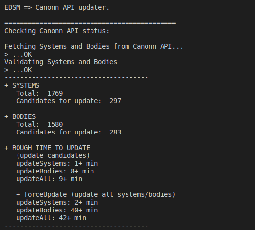

# CAPIv2-Updater

Nodejs based tool to update the Canonn API with planetary and stellar data from EDSM


___

<!-- TOC -->

- [CAPIv2-Updater](#capiv2-updater)
    - [Requirements](#requirements)
    - [Setup](#setup)
    - [Settings.js](#settingsjs)
    - [Usage](#usage)
        - [status](#status)
            - [status:dev](#statusdev)
        - [reports](#reports)
            - [reports:dev](#reportsdev)
        - [updateSystems](#updatesystems)
            - [updateSystems:dev](#updatesystemsdev)
        - [updateBodies](#updatebodies)
            - [updateBodies:dev](#updatebodiesdev)
        - [updateAll](#updateall)
            - [updateAll:dev](#updatealldev)

<!-- /TOC -->
___

## Requirements

- node.js >= v10.14.1

## Setup

- clone the repository
- `npm install`
- create `.env` file in main repository directory (See .env.example)
- Build the package with `npm run build`

## Settings.js

Configuration options for the CAPIv2-Updater

```javascript
/* 
===================
= Script Settings =
===================
*/

//Timedate formats for dates in updater
//For more info see: https://developer.mozilla.org/en-US/docs/Web/JavaScript/Reference/Global_Objects/Date/toLocaleString
export const LOCALE = 'en-US';
export const TIMEZONE = 'America/Phoenix';


/* 
================
= API Settings =
================
*/

/* EDSM Options */
// EDSM API url
export const API_EDSM_URL = 'https://www.edsm.net';

// delay in [ms] for EDSM calls
export const EDSM_DELAY = 1500;

// max number of systems in one call for EDSM
export const EDSM_MAX_CALL_STACK = 25;

// Time to wait if 429 code is encountered
export const ERR429_DELAY =  300000; // 5 min


/* Canonn APIv2 Options */

// Canonn API urls - This is currently configured to work on the development server
export const API_CANONN_GRAPHQL = 'https://api.canonn.tech:2083/graphql';
export const API_CANONN_REST = 'https://api.canonn.tech:2083';
//export const API_CANONN_GRAPHQL = 'http://localhost:1337/graphql';
//export const API_CANONN_REST = 'http://localhost:1337';

// max limit per one GraphQL query for Canonn API
// consult with your nearest Canonn API admin
export const API_CANONN_STEP = 1000; 

// delay in [ms] for CAPI calls
export const API_CANONN_DELAY = 25;

// Duplication checking distance in kilometers
export const MIN_DISTANCE = 5;

// Enums for report types and statuses - see Strapi CAPI (he_he_he) enums, they should be the same.
export const REPORT_TYPES = {
	new: "new",
	update: "update",
	error: "error"
}

export const REPORT_STATUS = {
	pending: "pending",
	updated: "updated",
	verified: "verified",
	accepted: "accepted",
	declined: "declined",
	issue: "issue",
	duplicate: "duplicate"
}

export const DEFAULT_CMDR = 'zzz_Unknown';
```

## Usage

These are the following commands for running the updater.
___

### status

Displays basic status of Canonn API

`npm run updater status`

#### status:dev

Used to display the status without building while in a development mode

`npm run updater:dev status`
___

### reports

Used to validate reports and convert them to sites

`npm run updater reports:[ap,bm,bt,...]`

#### reports:dev

Used to validate reports and convert them to sites without building while in a development mode

`npm run updater:dev reports:[ap,bm,bt,...]`
___

### updateSystems

Update all Systems that are candidates

`npm run updater systems`

You can also query for specific systems

`npm run updater systems:[1,2,3,...]`

#### updateSystems:dev

Update all Systems that are candidates without building

`npm run updater:dev systems`

You can also query for specific systems without building

`npm run updater systems:[1,2,3,...]`
___

### updateBodies

Update all Bodies that are candidates

`npm run updater bodies`

You can also query for specific bodies.

`npm run updater bodies:[1,2,3,...]`

#### updateBodies:dev

Update all Bodies that are candidates without building

`npm run updater:dev bodies`

You can also query for specific bodies without building

`npm run updater:dev bodies:[1,2,3,...]`
___

### updateAll

Update all systems and bodies that are candidates

`npm run updater systems bodies`

#### updateAll:dev

Update all systems and bodies that are candidates without building

`npm run updater:dev systems bodies`
